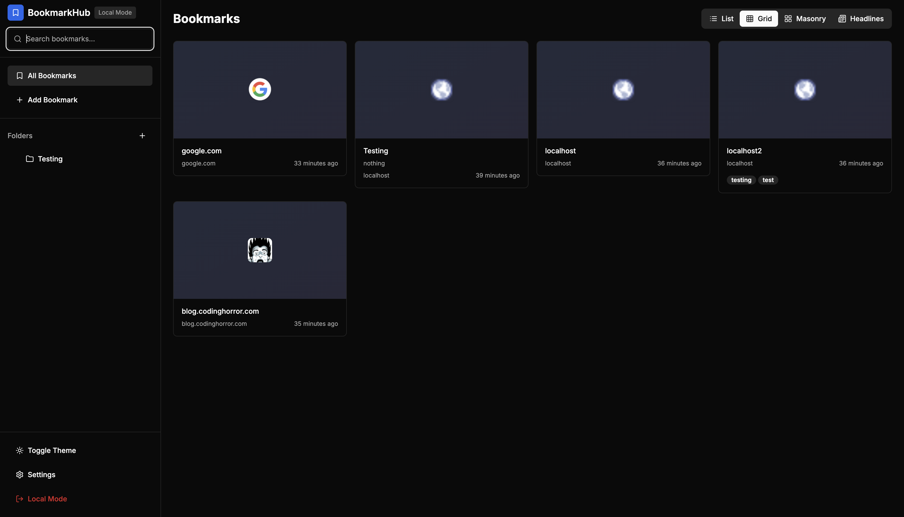

# BookmarkHub - Bookmark Extension

[](https://nextjs.org/)
[](https://www.typescriptlang.org/)
[](https://tailwindcss.com/)
[](https://supabase.com/)

A modern bookmark management application built with Next.js, TypeScript, and Tailwind CSS.



## Features

- 📚 **Bookmark Management**: Add, edit, delete, and organize bookmarks
- 📁 **Folder Organization**: Create folders to organize your bookmarks
- 🏷️ **Tagging System**: Add tags to categorize bookmarks
- 🎨 **Modern UI**: Beautiful, responsive interface with dark/light theme support
- 🔄 **Real-time Sync**: When configured with Supabase, bookmarks sync across devices
- 💾 **Local Storage**: Works offline with local storage when Supabase is not configured
- 🔍 **Smart Search**: Debounced search across titles, URLs, descriptions, and tags
- 🎯 **Favicon Support**: Automatic favicon fetching for better visual organization

## Authentication Modes

### Local Mode (Default)

The app works without authentication by default. All data is stored locally in your browser's localStorage.

### Supabase Mode (Optional)

To enable cloud sync and authentication:

1. Create a `.env.local` file in the root directory
2. Add your Supabase credentials:
   ```
   NEXT_PUBLIC_SUPABASE_URL=your-supabase-url
   NEXT_PUBLIC_SUPABASE_ANON_KEY=your-supabase-anon-key
   ```
3. Restart the development server

## Quick Start

### 🚀 **Get Started in 3 Steps**

1. **Clone the repository**

   ```bash
   git clone <your-repo-url>
   cd bookmark-extension
   ```

2. **Install dependencies**

   ```bash
   yarn install
   # or
   npm install
   ```

3. **Start the development server**

   ```bash
   yarn dev
   # or
   npm run dev
   ```

4. **Open your browser**
   Navigate to [http://localhost:3000](http://localhost:3000)

### ✨ **That's it!**

Your bookmark extension is ready to use. No configuration needed - it works out of the box with local storage!

## Screenshots

### 🏠 Home View (Grid Layout)


### 📝 Add Bookmark Dialog


### 📋 List View


### 🌞 Light Mode


## Usage

- **Add Bookmarks**: Click the "Add Bookmark" button in the sidebar
- **Organize**: Create folders to organize your bookmarks
- **Search**: Use the search bar to find bookmarks
- **Theme**: Toggle between light and dark themes
- **Local Mode**: When not authenticated, you'll see a "Local Mode" indicator

## Technology Stack

- **Frontend**: Next.js 13, React 18, TypeScript
- **Styling**: Tailwind CSS, Radix UI components
- **State Management**: TanStack Query (React Query)
- **Authentication**: Supabase Auth (optional)
- **Database**: Supabase (optional) / Local Storage (default)

## Key Features

### 🔍 **Smart Search**

- **Debounced search** for optimal performance
- **Multi-field search** across titles, URLs, descriptions, and tags
- **Real-time filtering** with visual feedback
- **Search results counter** showing number of matches

### 🎨 **Multiple View Modes**

- **Grid View**: Card-based layout for visual browsing
- **List View**: Compact list for quick scanning
- **Masonry View**: Pinterest-style layout
- **Headlines View**: Minimal list for focused reading

### 📁 **Folder Management**

- **Drag & drop** bookmark organization
- **Nested folder support** for complex organization
- **Move to folder** functionality with auto-switch to "All Bookmarks"
- **Folder-based filtering** with search integration

### 🎯 **Favicon Integration**

- **Automatic favicon fetching** using Google's favicon service
- **Fallback strategies** for reliable favicon display
- **Visual bookmark identification** with site logos
- **Loading states** for better user experience

## Development

The app is designed to work in two modes:

1. **Local Mode**: No authentication required, data stored in localStorage
2. **Supabase Mode**: Full authentication and cloud sync capabilities

This makes it perfect for both personal use and team collaboration scenarios.

## Contributing

We welcome contributions to BookmarkHub! Here's how you can help:

### 🚀 **Getting Started**

1. **Fork the repository** on GitHub
2. **Clone your fork** locally:
   ```bash
   git clone https://github.com/YOUR_USERNAME/bookmark-extension.git
   cd bookmark-extension
   ```
3. **Create a new branch** for your feature:
   ```bash
   git checkout -b feature/your-feature-name
   # or
   git checkout -b fix/your-bug-fix
   ```

### 🛠️ **Development Setup**

1. **Install dependencies**:

   ```bash
   yarn install
   ```

2. **Start the development server**:

   ```bash
   yarn dev
   ```

3. **Run linting and type checking**:
   ```bash
   yarn lint
   yarn type-check
   ```

### 📝 **Making Changes**

- **Follow the existing code style** (Prettier + ESLint)
- **Write TypeScript** with proper type definitions
- **Add comments** for complex logic
- **Test your changes** thoroughly
- **Update documentation** if needed

### 🎯 **Areas for Contribution**

- **🐛 Bug Fixes**: Fix issues and improve stability
- **✨ New Features**: Add new functionality
- **🎨 UI/UX Improvements**: Enhance the user interface
- **📱 Responsive Design**: Improve mobile experience
- **♿ Accessibility**: Make the app more accessible
- **🧪 Testing**: Add unit tests and integration tests
- **📚 Documentation**: Improve README, code comments, and guides
- **🌐 Internationalization**: Add multi-language support
- **🔧 Performance**: Optimize loading times and responsiveness

### 🔄 **Submitting Changes**

1. **Commit your changes** with clear messages:

   ```bash
   git add .
   git commit -m "feat: add new bookmark sorting feature"
   # or
   git commit -m "fix: resolve favicon loading issue"
   ```

2. **Push to your fork**:

   ```bash
   git push origin feature/your-feature-name
   ```

3. **Create a Pull Request** on GitHub with:
   - Clear title and description
   - Screenshots (if UI changes)
   - Reference to any related issues

### 📋 **Pull Request Guidelines**

- **Use descriptive titles** (e.g., "feat: add bookmark export functionality")
- **Provide detailed descriptions** of what changed and why
- **Include screenshots** for UI changes
- **Reference issues** using `Fixes #123` or `Closes #123`
- **Ensure all checks pass** (linting, type checking, etc.)

### 🏷️ **Commit Message Convention**

We use conventional commits:

- `feat:` - New features
- `fix:` - Bug fixes
- `docs:` - Documentation changes
- `style:` - Code style changes (formatting, etc.)
- `refactor:` - Code refactoring
- `test:` - Adding or updating tests
- `chore:` - Maintenance tasks

### 🐛 **Reporting Issues**

When reporting bugs, please include:

- **Clear description** of the issue
- **Steps to reproduce** the problem
- **Expected vs actual behavior**
- **Screenshots** (if applicable)
- **Browser/OS information**
- **Console errors** (if any)

### 💡 **Feature Requests**

For new features:

- **Describe the feature** clearly
- **Explain the use case** and benefits
- **Consider implementation** complexity
- **Check existing issues** to avoid duplicates

### 🤝 **Code of Conduct**

- Be respectful and inclusive
- Provide constructive feedback
- Help others learn and grow
- Follow the golden rule: treat others as you want to be treated

### 🎉 **Recognition**

Contributors will be recognized in:

- README contributors section
- Release notes
- GitHub contributors page

Thank you for contributing to BookmarkHub! 🚀

## License

This project is licensed under the MIT License.
